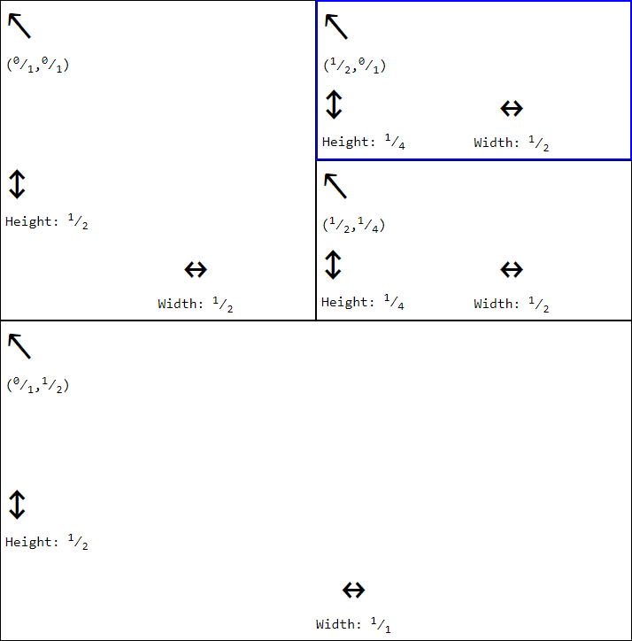

# wm

`wm` is a clojure(script) library which provides a datastructure that's useful for implementing a tiling window manager. 



## Usage

Add the following to your `:deps` map in your deps.edn:
```clojure
dev.jt.wm {:git/url "https://github.com/jjttjj/wm.git"
           :sha "108d7aedbd5fa7e930eb39ddecf2a20d8074425e"}
```

The `wm` function creates a window manager which manages a grid of rectangles and a current location. A rectangle is just a map with `:x`, `:y`, `:h`: and `:w` keys. All of these are either ratios or interger types from the [`com.gfredericks/exact`](https://github.com/gfredericks/exact) library. The grid is a sorted set of rectangles sorted by `:x`, `:y`. A coordinate is a vector of `:x` and `:y`. Location is the current coordinate.

You can split the current location with `split-down` or `split-right`. Navigation is possible with the `move-up`, `move-down`, `move-left` and `move-right` functions. `edit` applies a function to the current rectangle. 


```clojure
(ns my.ns
 (:require [dev.jt.wm :as wm]))


(-> (wm/wm)
    wm/split-down
    wm/move-down
    (wm/edit assoc ::my-content "new split!")
    wm/move-up)

```

## Demo

Demo code is [here](dev/demo.cljs). 
To run the demo, clone this repo and enter it and run 
```
clj -A:demo
```
